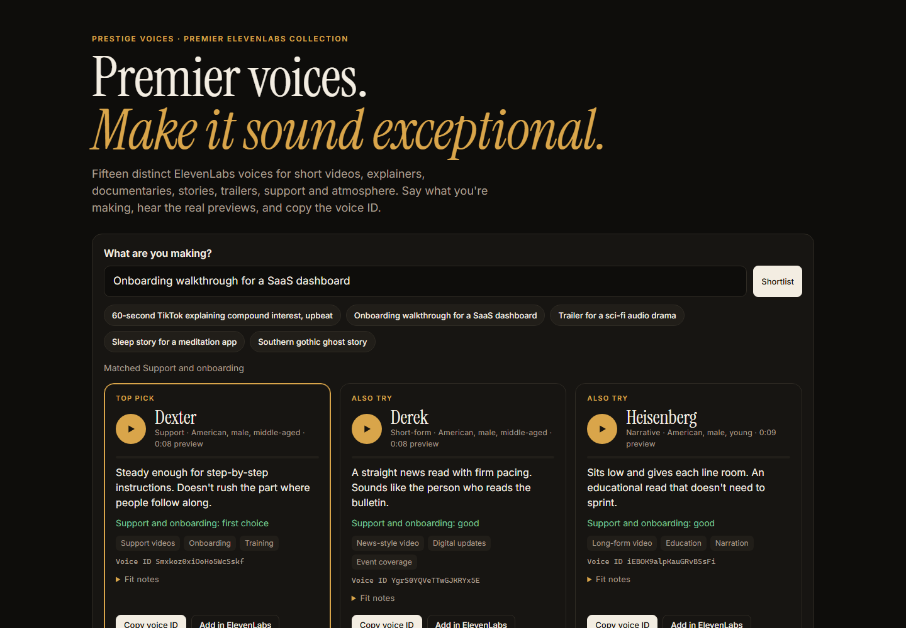

# Prestige Voices

**Premier voices. Make it sound exceptional.**

Prestige Voices is a premier collection of fifteen distinct ElevenLabs voices: deep documentary narrators, quick Short and Reel voices, a calm support guide, broadcast reads, trailer-scale performers, Southern storytellers and a close-mic comfort voice. It also includes a Claude skill that casts the right one for your project. Say what you're making and get a tailored shortlist. Then hear the real previews, get a script written for the voice you choose, and copy the exact voice ID into ElevenLabs.



[Audition the collection](https://bilbop1.github.io/prestige-voices/) · [Install the Claude skill](#install)

## Install

In Claude Code:

```
/plugin marketplace add bilbop1/prestige-voices
/plugin install prestige-voices@prestige-voices-marketplace
```

From your shell, run `claude plugin marketplace add bilbop1/prestige-voices`, then `claude plugin install prestige-voices@prestige-voices-marketplace`. Start a new Claude session after installing. The installed skill needs no Python, account key or executable helper. The optional standalone repository tools need Python 3.9 or newer and nothing else.

## Use it

```
/prestige-voices 45-second onboarding video showing dentists how to connect their calendar. Calm, not salesy.
```

You can also ask in plain words, like "which voice should I use for my trailer?", and Claude picks the skill up. Some Claude Code versions list the command as `/prestige-voices:prestige-voices`.

What happens next:

1. Claude shortlists two or three voices for that exact job and explains why each one fits.
2. You listen. Every voice has a real preview sample of 7 to 13 seconds. These are existing recordings, not audio made for your request.
3. You pick one, and Claude writes the script at that voice's pace in natural spoken language.
4. Claude gives you the voice ID, the ElevenLabs share link and the next step.

The installed plugin reads its bundled catalog to cast voices and write scripts. It links to auditions and ElevenLabs, where you generate audio separately. The directory bundle is in [`directory-plugin/`](directory-plugin/).

The standalone catalog tool also works on its own after cloning or downloading this repository, with no API key:

```
python3 skills/prestige-voices/scripts/voices.py recommend "trailer for a sci-fi audio drama"
python3 skills/prestige-voices/scripts/voices.py show "Titan Epic"
python3 skills/prestige-voices/scripts/voices.py showcase --out prestige-voices.html --open
```

The last command writes a single-page audition board where you can play every voice side by side. The same page is in [`showcase/index.html`](showcase/index.html).

## The collection

| Voice | Made for | Listen |
|---|---|---|
| **Titan** | Serious explainers, Documentary, Story recaps | [8s preview](https://voicefieldguide.com/audio/A02_003_dtSEyYGNJqjrtBArPCVZ_preview.mp3) |
| **Jett** | YouTube explainers, Commentary, Short stories | [10s preview](https://voicefieldguide.com/audio/A03_001_Hi6tnmUNNYzDCgW5eJyH_preview.mp3) |
| **Derek** | News-style video, Digital updates, Event coverage | [8s preview](https://voicefieldguide.com/audio/A05_001_YgrS0YQVeTTwGJKRYx5E_preview.mp3) |
| **Pulse** | Trending stories, Reels, Short updates | [9s preview](https://voicefieldguide.com/audio/A07_001_mhgBlD8CmCSdwLDOIJpA_preview.mp3) |
| **Dexter** | Support videos, Onboarding, Training | [8s preview](https://voicefieldguide.com/audio/A13_002_Smxkoz0xiOoHo5WcSskf_preview.mp3) |
| **Bilbop** | YouTube Shorts, Creator content, Social video | [8s preview](https://voicefieldguide.com/audio/A01_001_R23cI2hqxAhT17IXmY7O_preview.mp3) |
| **Heisenberg** | Long-form video, Education, Narration | [9s preview](https://voicefieldguide.com/audio/A02_002_iEBOK9alpKauGRvBSsFi_preview.mp3) |
| **Titan Epic** | Sci-fi, Trailers, Story podcasts | [13s preview](https://voicefieldguide.com/audio/A02_004_f5KRUAmxOzuhrrp8V3zv_preview.mp3) |
| **Reverend** | Faith-based content, Monologues, Motivation | [12s preview](https://voicefieldguide.com/audio/A04_001_87tjwokZlpNU7QL3HaLP_preview.mp3) |
| **Drift** | Relaxation, Comfort reads, Intimate narration | [13s preview](https://voicefieldguide.com/audio/A06_001_pampc2KWlRlw8L7yICFx_preview.mp3) |
| **Havoc** | Southern gothic, Folklore, Trailers | [10s preview](https://voicefieldguide.com/audio/A08_001_dtVZnErhiiosqofxDzSH_preview.mp3) |
| **Timber** | History, Tall tales, Deep dives | [9s preview](https://voicefieldguide.com/audio/A09_001_1gcivRWlUUhp7wLqy7GB_preview.mp3) |
| **Felix** | Animated content, Viral storytelling, Motivation | [9s preview](https://voicefieldguide.com/audio/A10_001_9IP7wm1J29XaLxnNLxev_preview.mp3) |
| **Snap** | Hooks, Reels, Sales scripts | [8s preview](https://voicefieldguide.com/audio/A11_001_gWaDC0oXAheKoZfljzuI_preview.mp3) |
| **Reel** | Short content, Sales calls, Clips | [8s preview](https://voicefieldguide.com/audio/A12_001_JKbdwi8BFwQlr1n3fwoT_preview.mp3) |

The source metadata lists English for all fifteen voices.

<details>
<summary>Fit notes</summary>

Each voice is at its best on certain material. These notes help you get the most from each one.

- **Titan:** the weight can flatten light or playful topics.
- **Jett:** speed exposes padding, so trim the script first.
- **Derek:** formal by default. Test names and dates first.
- **Pulse:** best on light recaps. Heavy news wants a steadier voice.
- **Dexter:** built for clarity, so hype copy sounds polite.
- **Bilbop:** made for short pieces. The energy wears on a listener over several minutes.
- **Heisenberg:** unhurried. Under a minute, a quicker voice fits more words.
- **Titan Epic:** save it for scripts with real stakes. Plain information sounds overacted.
- **Reverend:** use it when a preacher's voice belongs in the script.
- **Drift:** keep the mix sparse. It disappears under loud music.
- **Havoc:** the accent and grit are the point. Neutral corporate copy is the wrong home.
- **Timber:** the regional warmth is a choice that may not suit global corporate audiences.
- **Felix:** big swings. Not for instructions or news.
- **Snap:** built for the hook. Consider a calmer voice for the rest of the script.
- **Reel:** matter-of-fact. Dramatic narration sounds flat.

</details>

Voice IDs and ElevenLabs share links for every voice are in [`voices.json`](skills/prestige-voices/references/voices.json), or run `voices.py show <name>`.

## Generating audio

You don't need this plugin to generate. Open the voice's share link while signed in to ElevenLabs, add it to My Voices, and use it in ElevenLabs Text to Speech like any other voice.

Whether that works depends on your ElevenLabs account. The voice has to be in My Voices, and ElevenLabs says Voice Library voices aren't available through its API on the free tier. Every generation uses your own credits, and the owner of a shared voice can change or withdraw it.

For command-line generation, this repository has an optional standalone helper, `skills/prestige-voices/scripts/tts.py`. It is outside the installed plugin, which has no generation capability or key handling. The helper calls the official ElevenLabs text-to-speech API with the voice you picked:

- It reads your key from the `ELEVENLABS_API_KEY` environment variable, which you set in your own shell. Don't paste keys into a chat.
- `tts.py check --voice <name>` asks ElevenLabs whether your account can see that exact voice. It costs no credits.
- `tts.py speak ...` does a dry run by default and sends nothing. It only generates, and spends your credits, when you add `--confirm-billable`.
- If your account can't use the voice, it tells you why and stops. It never switches to a different voice and never retries on its own.
- If the connection drops after a generation request was sent, it tells you the outcome is unknown so you can check your ElevenLabs history before trying again.
- It never follows redirects with your key, and it strips the key from any error text it shows.
- It refuses to overwrite files unless you pass `--force`, and it saves nothing unless ElevenLabs actually returns audio.

## What runs and where data goes

The catalog and recommendation helpers run offline on your machine. Claude drafts your scripts and explanations through your own Claude account, under that product's data handling. The plugin has no backend, analytics or telemetry of its own.

Network requests happen only when you ask for them:

- Preview playback and downloads, and the voice pages, are public files on voicefieldguide.com. That host sees ordinary web requests, as any website would.
- Share links open elevenlabs.io in your browser.
- `tts.py` sends your key, the voice ID and, when generating, your script to api.elevenlabs.io.

The showcase page carries its fonts inline, so it loads nothing from font services. Details for these standalone tools are in [PRIVACY.md](PRIVACY.md). The installed skill's policy is in [directory-plugin/PRIVACY.md](directory-plugin/PRIVACY.md).

## Limitations

- The previews are fixed samples. Your script, model and settings will sound different, so audition a line of your own before a long render.
- Recommendations come from a hand-written fit table and keyword matching. Treat them as a strong starting point and let your ears decide.
- Not affiliated with or endorsed by ElevenLabs or Anthropic.

## License

The code and text in this repository are MIT licensed (see [LICENSE](LICENSE)). The embedded Instrument Serif and Inter fonts are under the SIL Open Font License (see `skills/prestige-voices/assets/fonts/`). Neither license covers the voices. The voice models are used through ElevenLabs under ElevenLabs' terms and your plan, and the preview audio is linked, not included. See [NOTICE.md](NOTICE.md).

## Development

```
python3 -m unittest discover -s tests
claude plugin validate --strict .
```

The tests run offline against local mock servers. They cover recommendations for distinct jobs, missing keys, denied voice access, refused redirects, dropped connections, the billing gate and output path safety. If you change `voices.json` or the showcase template, regenerate the page with `python3 skills/prestige-voices/scripts/voices.py showcase --out showcase/index.html --force`.
